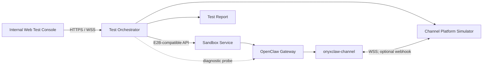

# OnyxClaw：E2B 兼容 Sandbox 端到端验证方案

> 状态：本机 macOS 与阿里云 ACS 云端主链路均已跑通；connect/pause/resume 和差异测试待实施
> 日期：2026-07-19
> 输入需求：[init.md](./init.md)
> 本版调整：补充本机/云端双轨范围、本机验收矩阵和 Phase 1 串行流程

## 1. 结论

OnyxClaw 第一阶段不应建设完整消费级 APP，而应建设一个可容器化部署的**内部 Web 测试控制台 + Test Orchestrator + Sandbox 内测试 Channel Plugin**。

它只回答一个核心问题：

> 客户能否通过我们的 E2B 兼容 API 创建 Sandbox，在其中安装并运行 OpenClaw 和自定义 Channel Plugin，完成文件操作、消息交互、暂停恢复和网络连接？

因此云端第一阶段：

- 保留三个云服务验证页，但每个页面只承载验证云服务所需的最小能力；
- 正常聊天必须经过测试 Channel Plugin，模拟客户真实链路；
- Gateway WebChat/RPC 只用作诊断对照；
- 不建设 PWA 安装、原生 APP、完整用户体系、复杂人格产品、语音产品和聊天产品功能；
- 不抽象多家 Sandbox Provider，直接使用 E2B SDK/API，并允许通过配置切换 API Base URL；
- 重点产出机器可读测试报告、步骤耗时、错误定位和可复现信息。

### 1.1 本机与云端是两条验证轨道

为了先验证 OpenClaw 应用层链路，项目增加了不经过 Sandbox 的 macOS 本机轨道：

| 轨道 | 目标 | Sandbox | 当前状态 |
| --- | --- | --- | --- |
| 本机 macOS | 验证 Plugin、Channel、Gateway、`SOUL.md` 和 UI 交互 | 不创建、不连接 | 已完成 |
| 云端 E2B | 验证 Sandbox API、生命周期、网络和持久化语义 | 必须使用 | 基础设施及 create/commands/files/kill 已通过 |

本机轨道直接使用当前 Mac 已安装的 OpenClaw。它证明测试 Plugin、Simulator、
Orchestrator 和 UI 能工作，但不能替代 create/connect/pause/resume/kill 等 Sandbox
能力验收。后文未特别标注“本机”的架构、API 和验收项，均表示云端目标设计。

## 2. 验证范围

### 2.1 必须验证的云服务能力

| 云服务能力 | 验证方式 | 通过标准 |
| --- | --- | --- |
| Sandbox 创建 | 调用 E2B 兼容 create API | 返回 Sandbox ID，状态可查询 |
| Sandbox 连接 | 使用 Sandbox ID 调用 connect | Running/Paused 均能得到有效连接信息 |
| 超时与生命周期 | 设置 timeout，观察状态变化 | 行为符合 API 约定，不意外丢失数据 |
| Pause/Resume | 活跃 Channel 期间暂停并恢复 | 连接断开可观测，恢复后 Plugin 自动重连 |
| 文件系统 | 写入、读取、覆盖 `SOUL.md` | 内容和 hash 一致，恢复后仍存在 |
| 命令与进程 | 安装 Plugin、启动 Gateway | exit code、stdout/stderr 和进程状态正确 |
| 环境变量/Secret 注入 | 注入 Channel token、模型凭据 | 进程可使用，API/日志不泄露明文 |
| 出站网络 | Plugin 主动建立 WSS | 心跳稳定，断线可重连 |
| 入站端口代理 | 可选 webhook/health endpoint | 外部可访问，鉴权和 WebSocket upgrade 正常 |
| 持久化 | 写文件后 pause/resume | workspace 与必要运行状态保留 |
| 并发与幂等 | 重复 create/connect/send | 不产生非预期重复实例或重复消息 |
| 错误返回 | 无效 ID、过期 token、启动失败 | 状态码和错误信息可定位且符合兼容约定 |

### 2.2 需要模拟的 OpenClaw 客户行为

- 在 Sandbox 中安装或启用自定义 Channel Plugin；
- 写入 OpenClaw 配置和 workspace 文件；
- 启动或重启 OpenClaw Gateway；
- Plugin 向外部平台建立长连接，或者暴露 webhook；
- 外部用户发送消息，Plugin 将消息交给 OpenClaw；
- Plugin 把 OpenClaw 回答投递回外部平台；
- Sandbox pause 导致连接中断；
- connect/resume 后 Gateway 和 Plugin 恢复工作；
- Plugin/OpenClaw 版本不兼容时给出明确结果。

### 2.3 第一阶段明确不做

以下能力不直接验证 Sandbox 服务，因此从 MVP 移除：

- PWA 安装、Service Worker、离线缓存；
- iOS/Android 原生 APP 和应用商店发布；
- OIDC/OAuth、多租户、用户注册和账号注销；
- 人格模板市场、高级人格参数、diff、版本历史和回滚 UI；
- 完整聊天历史、多会话管理、消息编辑、reaction、富 Markdown 阅读器；
- 语音输入、STT、TTS、WebRTC 和后台音频；
- Push Notification 和离线消息产品能力；
- 计费、用户配额、数据导出和隐私中心；
- 多云 Provider Adapter；
- 远程连接用户 macOS 的 Local Connector；
- 生产级高可用、横向扩容和复杂消息队列。

这些能力只有在它们对应明确的 Sandbox 验证目标时才重新加入。

## 3. 最小系统架构



### 3.1 Internal Web Test Console

这是内部测试界面，不是面向终端用户的产品。

职责：

- 触发测试场景；
- 展示每一步状态、耗时和原始错误；
- 输入或复制 Sandbox ID；
- 写入测试 `SOUL.md`；
- 发送文字消息并显示回复；
- 下载 JSON 测试报告。

不保存云 API Key、Gateway token 或 Channel token。内部访问控制优先复用云服务的 IAM、VPN、Ingress allowlist 或现有测试环境认证，不自建用户系统。

### 3.2 Test Orchestrator

Test Orchestrator 是常驻容器服务，取代原方案中产品化的 BFF。职责：

- 使用 E2B SDK/API 调用待测 Sandbox 服务；
- 编排 create、connect、files、commands、pause、resume、kill；
- 上传、安装、配置测试 Plugin；
- 承载 Channel Platform Simulator；
- 管理测试步骤、timeout、重试和清理；
- 采集请求结果、耗时、Sandbox 日志和 Channel 事件；
- 生成机器可读测试报告；
- 使用 Gateway probe 做故障隔离。

第一阶段不需要业务数据库。单次测试状态保存在内存，结果写为 JSON artifact；如果部署平台容器文件系统不持久，则上传到对象存储或由 CI 保存。只有需要跨天查询历史测试时才增加 PostgreSQL。

### 3.3 Channel Platform Simulator

它模拟客户 Channel 所连接的外部聊天平台，而不是一个完整聊天产品。

最小职责：

- 为测试实例签发一次性 Channel bootstrap token；
- 接受 Plugin 注册和心跳；
- 向 Plugin 发送 inbound text event；
- 接收 Plugin outbound text event 和 delivery receipt；
- 使用 event ID 去重；
- 记录断开、重连、心跳和端到端耗时；
- 支持少量故障注入：断连、延迟、重复事件和无效 token。

### 3.4 `onyxclaw-channel` 测试 Plugin

Plugin 使用 OpenClaw 官方 Channel Plugin SDK，不修改 OpenClaw core。

最小文件：

```text
onyxclaw-channel/
├── package.json
├── openclaw.plugin.json
├── index.ts
├── setup-entry.ts
└── src/
    ├── channel.ts
    ├── inbound.ts
    ├── outbound.ts
    ├── transport-websocket.ts
    └── channel.test.ts
```

MVP 能力：

- manifest、config schema 和 setup entry；
- 单 account；
- WSS 主动连接、认证、心跳和指数退避重连；
- inbound text；
- outbound text 和 delivery receipt；
- sender/chat/thread/message ID 映射；
- event ID 幂等；
- Plugin、OpenClaw 和协议版本上报；
- discovery/setup-only 模式不启动网络；
- full registration mode 才启动 transport；
- 结构化日志和 health 状态。

暂不实现媒体、reaction、多账号、群聊 mention、复杂 pairing 和主动推送。若真实客户 Channel 依赖这些能力，再逐项增加。

### 3.5 为什么 MVP 优先 WSS

WSS 模式最适合验证 Sandbox：

- Plugin 从 Sandbox 主动出站，通常不需要额外开放入站端口；
- 长连接可以直接验证网络稳定性、心跳和空闲连接策略；
- pause 时连接必然断开，resume 后可验证自动重连；
- 可以验证 token、DNS、TLS 和代理兼容性。

Webhook 模式放到第二阶段，用于专门验证 Sandbox 端口暴露、HTTP route、TLS 终止和 WebSocket upgrade。两种 transport 应共用相同的 Channel inbound/outbound 逻辑。

## 4. 云端控制台三个验证页的最小能力

### 4.1 页签一：Sandbox 生命周期

提供以下按钮：

- `Create Sandbox`；
- `Connect by Sandbox ID`；
- `Pause`；
- `Resume/Connect`；
- `Restart Gateway`；
- `Kill Sandbox`；
- `Run Full E2E`。

页面只展示验证需要的信息：

- Sandbox ID；
- Sandbox 实时状态；
- template/OpenClaw/Plugin 版本；
- Gateway 和 Channel health；
- 当前测试步骤及耗时；
- stdout/stderr 摘要；
- trace ID 和原始错误；
- 测试报告下载。

不实现用户画像、龙虾头像、成本仪表盘、通知中心和复杂运营状态。

### 4.2 页签二：`SOUL.md` 文件验证

仅提供：

- 读取当前 `SOUL.md`；
- 一个 Markdown 文本框；
- 写入并读取校验；
- 展示文件路径、大小、hash 和修改时间；
- pause/resume 后再次读取并比对；
- 恢复固定测试内容。

只保留一个默认人格样例，不提供人格模板选择、高级参数、版本历史或冲突合并。这里验证的是 Sandbox Filesystem API 与持久化，不是人格产品体验。

### 4.3 页签三：Channel 消息验证

仅提供：

- 单个测试 sender、chat 和 thread；
- 文本输入框和发送按钮；
- inbound 已接收、Agent 处理中、outbound 已投递三个状态；
- OpenClaw 最终文字回复；
- message/event ID；
- 各阶段耗时；
- 断开 Channel、恢复连接、重复发送三个故障按钮；
- 一键执行 `send → pause → resume → reconnect → send`。

不实现聊天产品常见的多会话、搜索、附件预览、编辑、语音、已读状态和本地离线草稿。

### 4.4 已实现的本机串行 UI

本机 UI 不展示 Sandbox 生命周期按钮，而是一个有服务端门禁的串行 onboarding：

```text
01 进入龙虾模式 → 02 确认 SOUL.md 性格 → 03 和龙虾对话
```

1. 第一步链接/配置测试 Plugin、启动本机 Simulator、重启并探测本机 Gateway；
2. 成功连接后才进入第二步，读取、编辑、原子写入并校验 `SOUL.md`；
3. 未确认性格时，BFF 拒绝 Chat API，而不只是前端隐藏按钮；
4. 确认后隐藏性格页并自动进入对话；
5. 首次进入对话时，通过真实 Channel 让 OpenClaw 基于性格生成一次主动问候；
6. 首次问候在 BFF 会话内去重，刷新页面不会重复调用模型；
7. 对话页可以断开、禁用测试 Channel 并清理 Simulator。
8. 浏览器刷新始终落在第一步，但只重置页面落点，不破坏服务端连接和确认状态。

本机 onboarding 状态目前以 BFF 进程为生命周期；重启 `npm run dev` 会重新模拟
新用户。这是本机测试夹具的明确边界，未来云端版应由 Sandbox ID 或内部测试 run
状态区分全新与已有实例。

## 5. 主端到端流程

### 5.1 全新 Sandbox

1. Test Orchestrator 调用 create API，获得 Sandbox ID。
2. 查询 Sandbox info，确认状态和模板版本。
3. 通过 Files API 写入测试 workspace 文件。
4. 通过 Files/Commands API 上传并安装 `onyxclaw-channel`。
5. 注入模型凭据、Gateway token 和一次性 Channel bootstrap token。
6. 写入最小 OpenClaw/Channel 配置。
7. 启动 Gateway，采集 command exit code 和日志。
8. Plugin 向 Platform Simulator 建立 WSS 并上报版本。
9. Orchestrator 等待 Gateway healthy 和 Channel connected。
10. Platform Simulator 下发一条 inbound text event。
11. Plugin 将消息分发给 OpenClaw Agent。
12. Plugin 将回答通过 outbound adapter 投递回 Simulator。
13. Simulator ack，控制台显示回复和各阶段耗时。
14. Orchestrator 读取 `SOUL.md`，确认文件内容。
15. 生成测试报告。

同一个测试 run 的 create 操作必须带幂等键，避免 UI 重试创建多个 Sandbox。

### 5.2 已有 Sandbox

1. 输入 Sandbox ID。
2. 调用 connect；Running 时延长 timeout，Paused 时恢复。
3. 使用本次 connect 返回的新连接信息，不复用旧 token。
4. 等待 Gateway 和 Plugin 恢复。
5. 验证 Plugin 重新注册，connection ID 已更新。
6. 读取 `SOUL.md` 并发送测试消息。
7. 输出恢复耗时和验证结果。

无需构建用户账号与 Sandbox 归属体系；该工具运行在内部可信测试环境。若未来对外开放，再增加资源归属和认证。

### 5.3 Pause/Resume 核心场景

1. 建立 Channel WSS 并成功完成一轮消息。
2. 记录 connection ID 和最后 heartbeat。
3. 调用 pause。
4. 验证 WSS 断开，并记录断开原因和时间。
5. 调用 connect/resume。
6. 验证文件仍存在。
7. 验证 Gateway 恢复；必要时测试是否需要显式重启。
8. 验证 Plugin 自动重连并获得新 connection ID。
9. 再发送一条消息并收到回复。
10. 报告 pause、resume、Gateway ready、Channel ready 的分段耗时。

这条流程是本项目最重要的验收场景。

### 5.4 故障隔离

当 Channel 消息失败时，按以下顺序定位：

```text
Sandbox 状态
  → Gateway 进程/端口
  → Gateway WebChat/RPC 对照探针
  → Plugin 是否加载
  → Plugin 到 Simulator 的网络与认证
  → inbound dispatch
  → outbound delivery
```

如果 Gateway 对照探针成功而 Channel 失败，问题在 Plugin 或 transport；两者都失败，优先检查 Sandbox、Gateway、模型凭据或进程状态。正常测试消息不能自动绕过 Channel，否则会产生假阳性。

## 6. Test Orchestrator API 草案

```http
POST /api/test-runs
GET  /api/test-runs/{runId}
GET  /api/test-runs/{runId}/report

POST /api/sandboxes
POST /api/sandboxes/{sandboxId}/connect
POST /api/sandboxes/{sandboxId}/pause
POST /api/sandboxes/{sandboxId}/restart-gateway
DELETE /api/sandboxes/{sandboxId}

GET  /api/sandboxes/{sandboxId}/soul
PUT  /api/sandboxes/{sandboxId}/soul
POST /api/sandboxes/{sandboxId}/soul/verify

POST /api/sandboxes/{sandboxId}/messages
POST /api/sandboxes/{sandboxId}/faults/disconnect-channel
WS   /api/test-events?runId=...

POST /internal/channel/register
POST /internal/channel/messages
POST /internal/channel/receipts
WS   /internal/channel/connect
```

内部 Channel 接口与浏览器 API 分离。Plugin 使用实例级 token；浏览器不得获得该 token。

## 7. 测试报告

每次 E2E run 输出一个 JSON 报告：

```json
{
  "runId": "...",
  "targetApiBaseUrl": "...",
  "sandboxId": "...",
  "templateVersion": "...",
  "openclawVersion": "...",
  "pluginVersion": "...",
  "startedAt": "...",
  "finishedAt": "...",
  "result": "passed",
  "steps": [
    {
      "name": "sandbox.resume",
      "result": "passed",
      "durationMs": 1234,
      "traceId": "..."
    }
  ],
  "artifacts": []
}
```

报告必须包含：

- API Base URL 和兼容版本；
- Sandbox/template/OpenClaw/Plugin 版本；
- 每一步开始时间、耗时、状态和重试次数；
- E2B API 状态码和脱敏后的错误；
- Gateway/Plugin health 变化；
- Channel connection ID、断线和重连时间；
- inbound/outbound event ID 和端到端延迟；
- stdout/stderr、Gateway 日志和 Plugin 日志 artifact 引用；
- 最终通过/失败及首个根因步骤。

不得包含 API Key、Gateway token、Channel token、模型 Key 或完整用户私密内容。

## 8. 配置与部署

### 8.1 配置

云端使用“一个 E2B 兼容实现 + 多个 Provider Profile”。详细字段、Secret 分层和
新增厂商流程见 [provider-config.md](./provider-config.md)。

部署选择：

```text
ONYXCLAW_PROVIDER_CONFIG
ONYXCLAW_PROVIDER
ARTIFACT_STORE_URL（可选）
```

Profile 保存 API URL、Template ID、Sandbox 路径、OpenClaw 启动信息、Channel
公开 URL、生命周期策略和 capability flags；Profile 只保存 Secret 环境变量名，
真实 API Key、模型 Key 和 signing secret 由环境变量或 Secret Manager 注入。

同一套测试可以通过切换受信任的 `ONYXCLAW_PROVIDER` 运行在：

- 你们的 E2B 兼容 Sandbox 服务；
- 官方/参考 E2B 环境；
- 本地 mock，用于 UI 和失败场景开发。

浏览器只能选择已经配置的 provider ID，不能传入任意 API URL。只有 contract test
证明某厂商存在无法配置化的语义差异时，才增加小型专用 Adapter。

### 8.2 Docker 部署

MVP 使用两个容器：

- `web`：内部测试控制台；
- `orchestrator`：E2B 编排、Channel Simulator、WebSocket 和报告生成。

也可以在最初技术验证阶段合并为一个容器。`orchestrator` 必须是常驻容器，支持 WebSocket，不能使用仅适合短请求的函数运行环境。

推荐链路：

```text
Tester Browser
  → Internal HTTPS Ingress
  → web / orchestrator containers
  → E2B-compatible API
  → Sandbox
```

如果要验证 VPC，Orchestrator 应部署到与 Sandbox 可互通的 VPC；如果要验证公网端口代理，则从独立网络执行相同探针，避免测试只覆盖内网路径。

## 9. 最低安全要求

即使是内部测试工具，也保留以下底线：

- API Key 和模型凭据只在 Orchestrator 服务端；
- Secret 通过云 Secret Manager/KMS 注入，不写入镜像；
- 日志统一脱敏；
- Channel Plugin 使用每 Sandbox 独立的短期 token；
- WSS 使用 TLS 并校验服务端证书；
- webhook 使用 HMAC 和时间戳防重放；
- 控制台通过内部 IAM/VPN/allowlist 访问；
- `Kill Sandbox` 要求二次确认；
- 测试完成后按配置自动清理 Sandbox；
- Orchestrator 只允许连接配置的 API host，避免 SSRF。

第一阶段不建设独立 OIDC、多租户 RBAC 和用户所有权模型。

## 10. 自动化与验收

### 10.1 自动测试层级

1. E2B API compatibility tests：create/connect/files/commands/pause/resume/kill；
2. Plugin contract tests：manifest、setup、registration mode、inbound/outbound；
3. Transport tests：认证、心跳、断线、重连、重复事件；
4. Full E2E：create → install → start → chat → pause → resume → chat；
5. Differential tests：同一测试分别运行在参考 E2B 与待测服务，对比语义而非内部实现。

### 10.2 MVP 验收标准

1. 一键创建 Sandbox 并返回可用 Sandbox ID。
2. 通过 API 安装/启用测试 Plugin，不依赖人工进入容器。
3. Plugin 能建立 WSS，完成一轮 inbound/outbound 文字消息。
4. `SOUL.md` 写入、读取和 hash 校验成功。
5. pause 后 Channel 断开可被准确观测。
6. connect/resume 后文件仍存在，Plugin 自动重连。
7. 恢复后第二轮消息成功，且无重复事件。
8. Gateway probe 能将 Channel 故障与 OpenClaw/Gateway 故障区分开。
9. 所有步骤生成带耗时和 trace ID 的 JSON 报告。
10. 浏览器、日志和报告中不出现密钥。

### 10.3 macOS 本机验收结果

验收环境：macOS、本机 OpenClaw 2026.6.11、Node.js 22.23.1。这里的“完成”只指
本机轨道，不包含 E2B API 和 Sandbox 生命周期。

| 本机验收项 | 结果 | 证据 |
| --- | --- | --- |
| Plugin 自动检查、按需链接和配置 | 通过 | `LocalMacOpenClawDriver.prepare` 及单元测试 |
| Gateway restart 与 connectivity probe | 通过 | 真实 Gateway `Connectivity probe: ok` |
| bootstrap token、session token 与 token 轮换 | 通过 | Transport/Simulator tests 与 Phase 0 E2E |
| loopback WebSocket 注册、心跳、断线和进程内自动重连 | 通过 | Transport tests 与人为断线 E2E |
| inbound → Agent → outbound 文字闭环 | 通过 | Phase 0 两轮消息与 Phase 1 smoke |
| `SOUL.md` 读取、原子写入、SHA-256 和逐字节恢复 | 通过 | Driver tests、Phase 0 E2E、Phase 1 smoke |
| Gateway 重启后文件保持一致 | 通过 | Phase 0 E2E |
| Phase 1 loopback BFF 与三个串行步骤 | 通过 | Controller/API/UI tests 与真实浏览器 API smoke |
| 未确认性格禁止聊天 | 通过 | BFF contract tests |
| 首次进入对话后基于性格主动问候且只生成一次 | 通过 | Controller tests 与真实 smoke |
| 失败启动自动禁用 Channel，正常退出可清理 | 通过 | Controller tests 与 smoke 最终步骤 |
| 修改型 localhost API 防跨站表单调用 | 通过 | 专用请求头校验测试 |
| 自动化回归 | 通过 | 38/38 tests passed（含 6 项 Provider 配置测试） |

最近一次真实 Phase 0 报告：

```text
artifacts/phase0-local-40f470c3-8858-445b-b7cb-f6efd6140421.json
```

最近一次真实 Phase 1 smoke 结果为 `passed`：性格问候约 5,122 ms，随后普通文字
消息约 2,502 ms，最后成功禁用测试 Channel。Smoke 输出机器可读 JSON 到 stdout；
Phase 0 runner 同时写入 JSON artifact。

本机轨道没有实现且不应被误判为缺口的能力：Sandbox create/connect/pause/resume/kill、
E2B Files/Commands API、云端 WSS/TLS、Docker 部署、差异测试、webhook、语音和媒体。

### 10.4 阿里云 ACS 云端验收进度

2026-07-19 已通过 IaC 创建真实 ACS 集群和预热池，使用固定 digest 的 OnyxClaw
v0.1.2 Sandbox 镜像及 `app-v0.1.0` APP 镜像完成以下验证：

| 云端验收项 | 结果 | 说明 |
| --- | --- | --- |
| ACS 基础设施与 Sandbox 组件 | 通过 | VPC、双 vSwitch、ACS、controller、manager 均已创建 |
| Release 镜像与同地域分发 | 通过 | GitHub Release 构建后复制到杭州 ACR，按 digest 部署 |
| `Sandbox.create` / `kill` | 通过 | 真实 E2B SDK 领取预热实例并在 finally 中释放 |
| `commands.run` | 通过 | envd 以 root 运行，命令显式使用 OpenClaw 的 node 用户 |
| `files.write/read` | 通过 | node 用户写读临时文件内容一致 |
| Secret 边界 | 通过 | smoke 从 `e2b-key-store` 读取转换后的运行时 Key，不输出明文 |
| APP 容器与 ClusterIP Service | 通过 | APP 从杭州 ACR 按 digest 拉取，在同一 ACS 集群内运行 |
| Provider/Secret 配置 | 通过 | E2B、MiniMax 和 Channel 凭据由 Kubernetes Secret 注入，不进入镜像和 Git |
| 新用户串行流程 | 通过 | 领取暖池 Sandbox → 确认 Soul → 进入聊天，服务端门禁生效 |
| OpenClaw bootstrap | 通过 | E2B Files 写入配置/Soul，Gateway 与 Channel 约 8 秒就绪 |
| MiniMax 首次问候 | 通过 | `minimax/MiniMax-M3` 经自定义 Channel 回复，实测约 13.7 秒 |
| MiniMax 普通文字对话 | 通过 | 回复符合 Soul 性格，实测约 2.4 秒 |
| Sandbox 清理 | 通过 | APP stop 调用 E2B kill，控制台回到 `idle/mode` |
| connect/pause/resume | 待实施 | 纳入完整云端生命周期 E2E |

可重复 smoke 位于 `iac/alicloud-acs/scripts/e2b-smoke.py`。本轮发现并修复了
`/run/e2b` 权限和 envd 非 root 导致的进程创建失败；账户余额不足产生的失败 Sandbox
不会自动重试，需要删除失败资源，由 SandboxSet 控制器重新创建。APP 实测还发现
Manager 返回的 `agents-vpc.infra` 地址不能在 APP Pod 内解析，因此部署清单必须设置
`E2B_ROUTE_DOMAIN=sandbox-gateway.sandbox-system.svc.cluster.local:7788`，将 Files 和
Commands 请求路由到集群内 Sandbox Gateway。该配置属于 provider 网络参数，不是密钥。

## 11. 分阶段交付

### Phase 0：无 UI 技术验证

- 使用脚本/测试直接调用 E2B API；
- 构建最小 Channel Plugin；
- 建立 WebSocket Simulator；
- 跑通 create → install → chat → pause → resume → chat；
- 固化 JSON 报告格式。

先完成 Phase 0，再决定 UI 细节。Phase 0 不依赖 Web 前端。

本机先导验证已于 2026-07-19 完成：最小 Channel Plugin、WebSocket Simulator、
session 自动重连、`SOUL.md` 写入/恢复、Gateway restart/probe、token 轮换和两轮
消息均已在 macOS OpenClaw 2026.6.11 上自动跑通。该结果验证了应用层测试夹具，
不等同于全部云端生命周期验收完成。2026-07-19 已在阿里云 ACS 用真实 E2B SDK
跑通 create、commands、files、OpenClaw bootstrap、自定义 Channel、MiniMax 对话和
kill；pause/connect/resume 仍需后续补充。

### Phase 1：最小 Web 控制台

- 三个页签；
- 手动操作和一键 Full E2E；
- 实时步骤、日志摘要和报告下载；
- Docker 镜像和云端内部部署；
- 参考 E2B 与待测服务的差异测试。

本机子阶段已于 2026-07-19 跑通：浏览器中的三个页签可管理当前 macOS 已安装的
OpenClaw，按“龙虾模式 → 性格确认 → 对话”串行执行，完成 Channel 生命周期、
`SOUL.md` 编辑/校验/恢复、服务端性格门禁、一次性性格问候和真实文字对话。
同日云端子阶段也已将 APP 以容器部署到 ACS，并通过同集群私网完成新用户领取
Sandbox、Soul 确认、OpenClaw/Channel 就绪、MiniMax 首次问候、普通文字对话和清理。
尚未完成的 Phase 1 项是 connect/pause/resume、JSON 报告下载和参考实现差异测试。

### Phase 2：按验证需求扩展

- webhook Channel transport；
- 入站端口与 WebSocket upgrade 验证；
- 文件/媒体消息；
- 并发 Sandbox 和资源限制测试；
- 网络故障、token 轮换、Gateway crash 等故障注入；
- 历史报告存储和趋势看板。

只有拿到明确客户行为证据后，才扩展多账号、群聊、pairing、reaction、语音或移动端。

## 12. 云端实施前需确认

1. 你们 E2B 兼容服务当前承诺兼容哪些 API 和 SDK 版本？
2. Sandbox pause/resume 是否同时保留文件系统、内存和进程？
3. 客户 Channel 使用长连接、webhook，还是两者均有？
4. 客户是在模板中预装 Plugin，还是在 Sandbox 创建后动态安装？
5. 客户 Gateway 和 Plugin 的启动方式是什么：foreground command、supervisor 还是容器入口？
6. 是否需要与官方 E2B 环境做自动 differential test？
7. 端口代理、VPC、出站网络分别有哪些产品承诺？
8. 首版是否只验证文字，媒体是否属于必须覆盖的客户场景？
9. Sandbox 测试完成后的清理和费用策略是什么？

## 13. 主要风险

| 风险 | 影响 | 缓解措施 |
| --- | --- | --- |
| 测试 Plugin 与客户 Plugin 行为不同 | 结果代表性不足 | 获取脱敏网络/生命周期特征，按证据扩展 |
| 只测预装模板 | 漏掉动态安装、文件和命令问题 | MVP 必须覆盖创建后安装 Plugin |
| 只测 WSS | 漏掉端口代理问题 | Phase 2 增加 webhook，并用独立 HTTP probe 先覆盖端口 |
| 自动绕过 Channel 使用 WebChat | Channel 故障被隐藏 | WebChat 只作诊断，正常用例禁止 fallback |
| pause/resume 事件丢失或重复 | 恢复测试不可靠 | event ID、ack、connection ID 和幂等 |
| Plugin SDK 变化 | 测试夹具无法加载 | 固定版本并维护小型兼容矩阵 |
| UI 开发挤占云服务验证 | 延误核心结论 | Phase 0 无 UI，先跑通自动化 E2E |

## 14. 官方参考资料

- [E2B：Connect to sandbox](https://e2b.dev/docs/api-reference/sandboxes/connect-to-sandbox)
- [E2B：Sandbox persistence](https://e2b.dev/docs/sandbox/persistence)
- [E2B：Read and write files](https://e2b.dev/docs/filesystem/read-write)
- [OpenClaw：Gateway protocol](https://docs.openclaw.ai/gateway/protocol)
- [OpenClaw：Agent workspace](https://docs.openclaw.ai/concepts/agent-workspace)
- [OpenClaw：Building Channel Plugins](https://docs.openclaw.ai/plugins/sdk-channel-plugins)
- [OpenClaw：Channel inbound API](https://docs.openclaw.ai/plugins/sdk-channel-inbound)
- [OpenClaw：Channel outbound API](https://docs.openclaw.ai/plugins/sdk-channel-outbound)
- [OpenClaw：Plugin entry points](https://docs.openclaw.ai/plugins/sdk-entrypoints)

## 15. 缩写与英文全称

| 缩写 | 英文全称 | 含义 |
| --- | --- | --- |
| API | Application Programming Interface | 应用程序编程接口 |
| SDK | Software Development Kit | 软件开发工具包 |
| E2B | E2B（品牌名） | E2B Sandbox API 兼容体系；不作非官方展开 |
| E2E | End-to-End | 端到端 |
| UI | User Interface | 用户界面 |
| MVP | Minimum Viable Product | 最小可行产品 |
| WSS | WebSocket Secure | 使用 TLS 保护的 WebSocket |
| HTTP | Hypertext Transfer Protocol | 超文本传输协议 |
| HTTPS | Hypertext Transfer Protocol Secure | 使用 TLS 保护的 HTTP |
| TLS | Transport Layer Security | 传输层安全协议 |
| HMAC | Hash-based Message Authentication Code | 基于哈希的消息认证码 |
| VPC | Virtual Private Cloud | 虚拟私有云 |
| IAM | Identity and Access Management | 身份与访问管理 |
| VPN | Virtual Private Network | 虚拟专用网络 |
| KMS | Key Management Service | 密钥管理服务 |
| SSRF | Server-Side Request Forgery | 服务端请求伪造 |
| ID | Identifier | 标识符 |
| JSON | JavaScript Object Notation | JavaScript 对象表示法 |
| RPC | Remote Procedure Call | 远程过程调用 |
